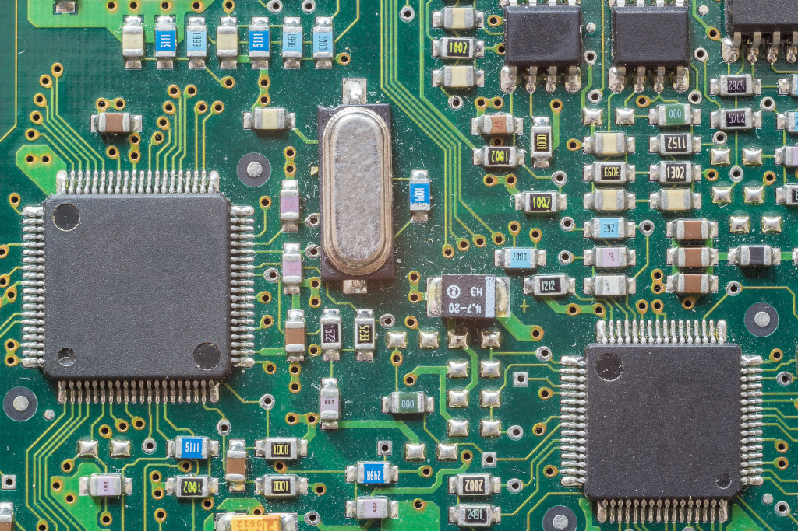

# Física Experimental III

Dados e análises do laboratório de eletrônica e circuitos da disciplina de Física Experimental III no Instituto de Física da USP.

- **Experimento 1** - Noções básicas de circuitos
- **Experimento 2** - Filtros RLC e tratamento de sinais
- **Experimento 3** - Movimento de partículas carregadas em campos eletromagnéticos
